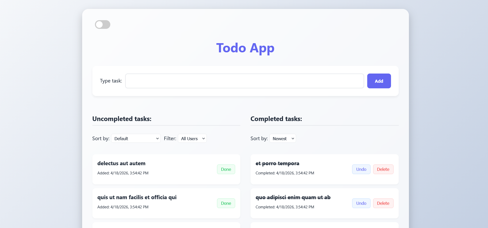
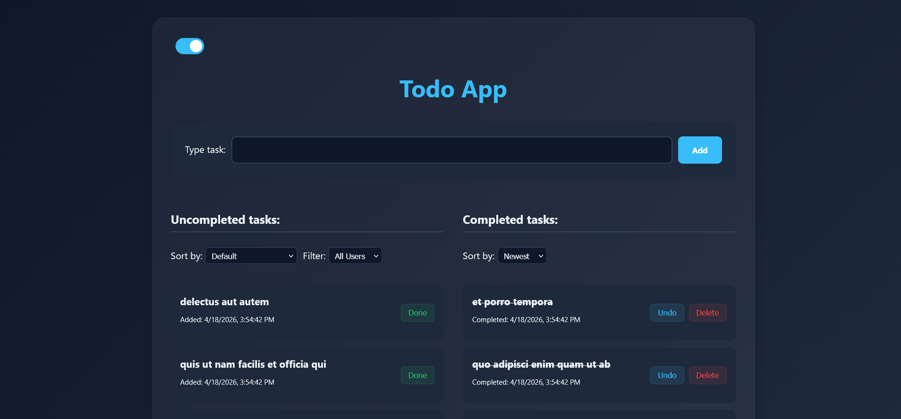

# React + TypeScript + Vite

This template provides a minimal setup to get React working in Vite with HMR and some ESLint rules.

Currently, two official plugins are available:

- [@vitejs/plugin-react](https://github.com/vitejs/vite-plugin-react/blob/main/packages/plugin-react) uses [Oxc](https://oxc.rs)
- [@vitejs/plugin-react-swc](https://github.com/vitejs/vite-plugin-react/blob/main/packages/plugin-react-swc) uses [SWC](https://swc.rs/)

## React Compiler

The React Compiler is not enabled on this template because of its impact on dev & build performances. To add it, see [this documentation](https://react.dev/learn/react-compiler/installation).

# Todo App By Maxim Project for DSS 📋

A modern, management application featuring a glass-like aesthetic, dark mode support, and suttle animations.

## 📸 Preview
 
 

## 🚀 Features
- **Fluid UI:** Modern glass-like backdrop filters and squircle styling.
- **Dark Mode:** Seamless toggle between light and dark themes.
- **Task Management:** Add, edit, and delete tasks with instant UI feedback.
- **Sorting function:** Sort by alphabetical order and by date completed.
- **Filtering:** Filter tasks by user.
- **Pagination:** Declutters the screen by limiting how many todos are displayed.
- **Responsive Design:** Optimized for mobile and desktop screens.

## 🛠 Prerequisites
To run this project, you need to have the following installed on your machine:
- **Node.js** (v14.0.0 or higher recommended)
- **npm** (comes with Node.js) or **yarn**

## 📦 Installation
1. Clone the repository:
   ```bash
   git clone [https://github.com/YOUR_USERNAME/YOUR_REPO_NAME.git](https://github.com/Max-Bero/TODO-APP-DSS-Project.git)

2. Running the project:
   ```bash
   npm create vite@latest
   npm run dev